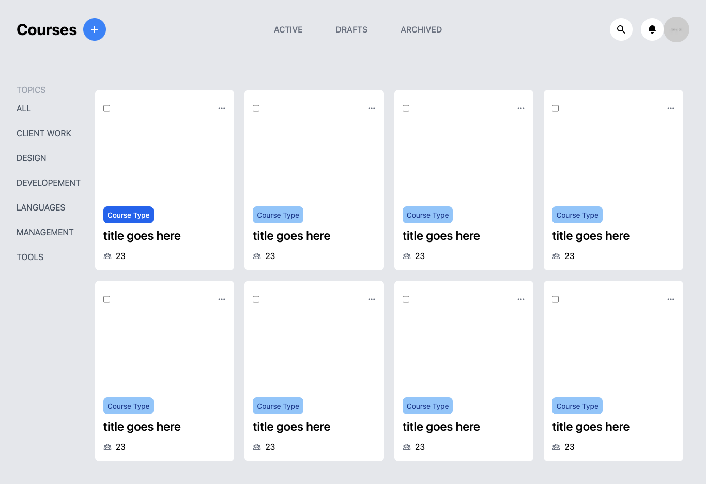

# Einstar - React.js + Tailwindcss
This is a single page web application built in [React.js](https://reactjs.org) and powered by [Next.js](https://nextjs.org) & [Tailwindcss](https://tailwindcss.com). The concept for the UI came from a post I saw on Pinterest by [Yevhen Kravchenko](https://dribbble.com/shots/7296254-Einstar-LMS-Courses-Animation?utm_source=pinterest&utm_campaign=pinterest_shot&utm_content=Einstar+LMS+-+Courses+Animation+%F0%9F%92%AB&utm_medium=Social_Share). For Hosting i'm using [Vercel](https://vercel.com) for simplicity.

> [Live Demo](https://react-einstar.vercel.app/)



## Requirement
- Next.js 
- Tailwindcss
- Node.js

## Setup

```
$ git clone git@github.com:conceptcodes/react-einstar.git
$ cd react-einstar
$ yarn install
$ yarn dev
```
Open `http://localhost:3000` and enjoy!


Compiles and minifies for production
```
$ yarn build
```


